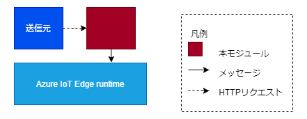

# HttpServer

## 目次
* [概要](#概要)
* [機能](#機能)
* [Quick Start](#quick-start)
* [イメージのURL](#イメージのurl)
* [動作保証環境](#動作保証環境)
* [Deployment 設定値](#deployment-設定値)
  * [環境変数](#環境変数)
  * [Desired Properties](#desired-properties)
  * [Create Option](#create-option)
* [受信メッセージ](#受信メッセージ)
  * [受信HTTPリクエスト](#受信httpリクエスト)
* [送信メッセージ](#送信メッセージ)
  * [送信HTTPレスポンス](#送信httpレスポンス)
  * [Message Body](#message-body)
  * [Message Properties](#message-properties)
* [Direct Method](#direct-method)
* [ユースケース](#ユースケース)
* [Feedback](#feedback)
* [LICENSE](#license)

## 概要
HttpServerは、HTTPリクエストを受信して、メッセージとして送信するIoT edgeモジュールです。

## 機能

* デフォルトでは、ポート8080でリクエストを待ち受ける。（環境変数「UriPrefix」の設定）
* 「UriPrefix」が指定されていない場合は、処理を終了する。
* リクエストがPOSTメソッドでない場合やリクエストのボディが空の場合は、処理を終了する。
* リクエストのヘッダから「additionalData」というキーで値を取得する。<br> 値が空でなければ、JSON からオブジェクトに変換して保持する。
* リクエストのボディからメッセージオブジェクトを生成する。
* 上で生成したメッセージオブジェクトのプロパティに「additionalData」の中のキーと値を設定する。
* 「output」という名前でメッセージを送信する。
* 呼び出し元にはレスポンス「200 OK」を返却する。（リクエストの内容にかかわらず）



## Quick Start
鋭意製作中

## イメージのURL
準備中
| URL                                                        | Description         |
| ---------------------------------------------------------- | ------------------- |

## 動作保証環境

| Module Version | IoTEdge | edgeAgent | edgeHub  | amd64 verified on | arm64v8 verified on | arm32v7 verified on |
| -------------- | ------- | --------- | -------- | ----------------- | ------------------- | ------------------- |
| 1.0.0          | 1.4.27  | 1.4.27    | 1.4.27   | ubuntu20.04       | －                  | －                  |


## Deployment 設定値

### 環境変数

#### 環境変数の値

| Key                 | Required | Default | Description                                                     |
| ------------------- | -------- | ------- |---------------------------------------------------------------- |
| UriPrefix           |〇        |         | リクエストを待ち受けるポートを指定する。 <br>例）http://+:8080/ <br> （「+」の箇所は状況に応じてホスト名やIPアドレスでも可） |
| LogLevel            |          | info    | 出力ログレベル。<br>["trace", "debug", "info", "warn", "error"]           |
| TransportProtocol   |          | Amqp    | ModuleClientの接続プロトコル。<br>["Amqp", "Mqtt"]                        |
| DefaultSendTopic    |          | IoTHub  | 送信時のトピック形式。 <br>["IoTHub", "Mqtt"]                            |
| M2MqttFlag          |          | false   | 通信に利用するAPIの切り替えフラグ。<br>false ： IoTHubトピックのみ利用可能。<br>true ： IoTHubトピックとMqttトピックが利用可能。ただし、SasTokenの発行と設定が必要。 |
| SasToken            | △       |         | M2MqttFlag=true時必須。edgeHubと接続する際に必要なモジュール毎の署名。 |

### Desired Properties

#### Desired Properties の値

| JSON Key | Type   | Required | Default | Description                  |
| -------- | ------ | -------- | ------- | ---------------------------- |
| output   | string |          | output  | 送信するメッセージのoutput名 |

#### Desired Properties の記入例

```json
{
  "output": "output1"
}
```

### Create Option

#### Create Option の値

| JSON Key                      | Type   | Required | Description                    |
| ----------------------------- | ------ | -------- | ------------------------------ |
| HostConfig                    | object | 〇        |                                |
| &nbsp; ExposedPorts           | object | △        | モジュール内の公開ポート設定。ポートバインドに8080を使用する場合は不要。      |
| &nbsp; &nbsp; xxxx/tcp        | object | △        | 公開したいポート番号(xは任意の番号)。 |
| &nbsp; &nbsp; &nbsp; {}       | object | △        | 値は不要。      |
| &nbsp; PortBindings           | object | 〇        | ポートバインド設定             |
| &nbsp; &nbsp; 8080/tcp        | object | 〇        | モジュール内の公開ポート       |
| &nbsp; &nbsp; &nbsp; HostPort | string | 〇        | デバイスにマップするポート番号 |

※開放するポートによって、「"8080/tcp"」（モジュール側）と「"HostPort": "80"」（ホスト側）の値を変更すること <br>

#### Create Option の記入例

```json
{
  "HostConfig": {
    "PortBindings": {
      "8080/tcp": [
        {
          "HostPort": "80"
        }
      ]
    }
  }
}
```

モジュール内部ポートに8080以外を使用する場合。

```json
{
  "HostConfig": {
    "ExposedPorts":{
      "8081/tcp":{}
    },
    "PortBindings": {
      "8081/tcp": [
        {
          "HostPort": "80"
        }
      ]
    }
  }
}
```

## 受信メッセージ

### 受信HTTPリクエスト

| Content               | Description             |
| --------------------- | ----------------------- |
| メソッド              | POST                    |
| ヘッダー              | リクエストヘッダー      |
| &nbsp; additionalData | メッセージの properties |
| 本文                  | メッセージの body       |

## 送信メッセージ

### 送信HTTPレスポンス

HTTPリクエストの送信元に返すレスポンス(リクエストの内容に関わらず同一)。

| Content              | Description |
| -------------------- | ----------- |
| プロトコルバージョン | 1.1         |
| ステータスコード     | 200         |
| テキストフレーズ     | "OK"        |

### Message Body

受信したHTTPリクエストの本文をそのまま送信する

### Message Properties

| Key | Description                                                      |
| --- | ---------------------------------------------------------------- |
| -   | リクエストのヘッダ「additionalData」キーの中身。名前や数は不定。 |

## Direct Method
なし

## ユースケース

Httpリクエストをメッセージとして転送する。

#### 受信HTTPリクエスト例

```JSON
＜Header＞
  additionalData：{"prop1":"aaa"}

＜Body＞
  {
    "RecordList":[{
      "RecordHeader": [
        "2020/11/11  12:00:00"
      ],
      "RecordData": [
        30, 40, 100000
      ]
    }]
  }
```

### 出力結果
受信したものがそのまま送信メッセージとなる。
リクエストのヘッダに「additionalData」というキーの値がある場合、それを送信メッセージのプロパティに設定する。

#### 出力例

```JSON
＜プロパティ＞
  {"prop1":"aaa"}

＜Body＞
  {
    "RecordList":[{
      "RecordHeader": [
        "2020/11/11  12:00:00"
      ],
      "RecordData": [
        30, 40, 100000
      ]
    }]
  }
```

## Feedback
お気づきの点があれば、ぜひIssueにてお知らせください。

## LICENSE
HttpServer is licensed under the MIT License, see the [LICENSE](LICENSE) file for details.
